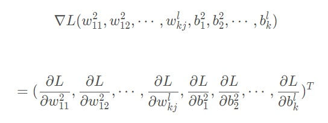
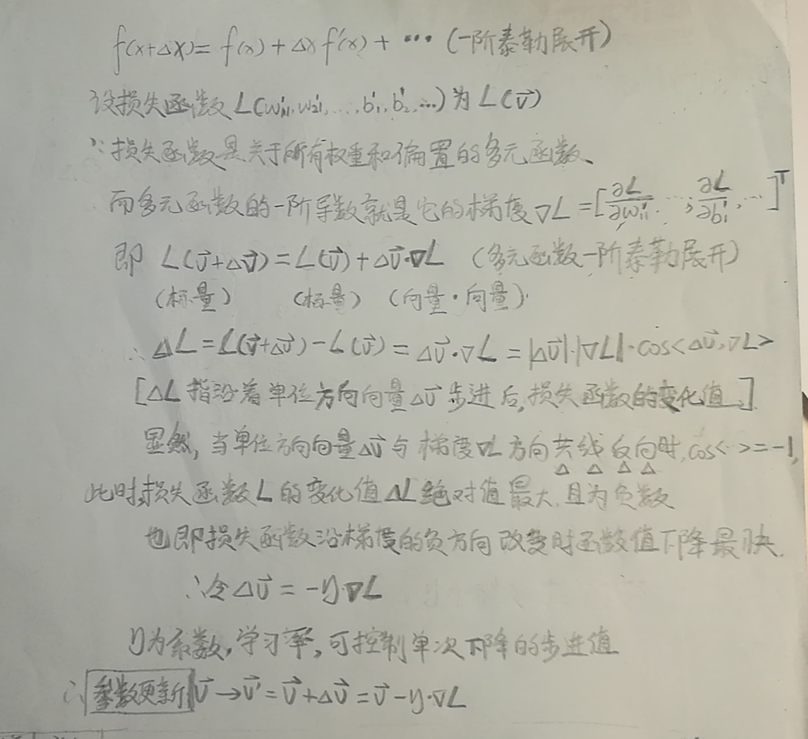
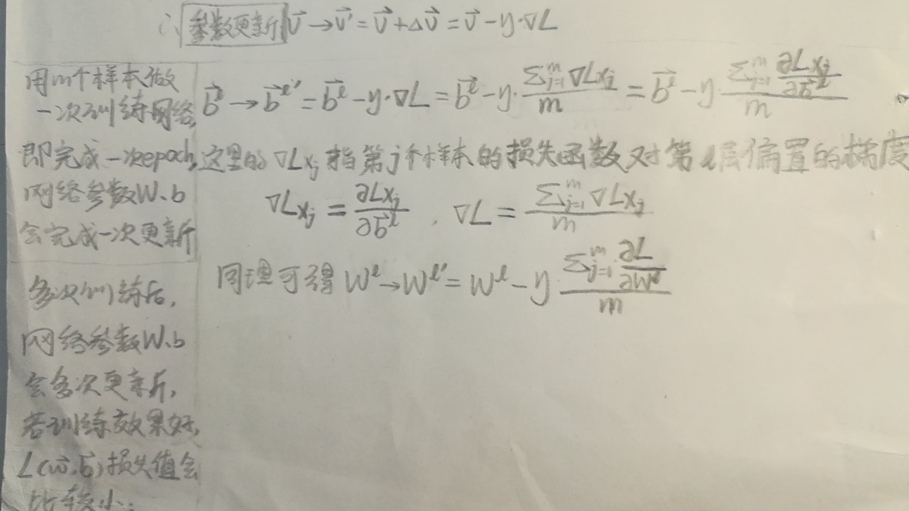

# 如何利用梯度下降法，寻找损失函数最小值？

> 梯度下降(Gradient Descent)是用于寻找函数最小值的一种优化算法。我们常常利用梯度下降法来使损失函数Loss function的值尽可能小，即让神经网络的预测值（实际输出）和标签值（预期的输出）尽可能接近。在这个过程中，网络参数——各层的权值与偏重将得到调整，这也正是神经网络的训练原理。可见熟悉梯度下降的原理对于理解神经网络相当重要。
> 本文将从损失函数概念、梯度下降原理 & 为什么沿梯度负方向函数值下降最快、梯度更新公式三个方面展开。

## 一、什么是损失函数(Loss function)？

损失函数通常为**多元函数**，其自变量包括网络中包含的所有的权重w、以及所有的偏置b，有的地方也将其称作代价函数(Cost function)，这里只介绍均方误差损失函数(MSE)：

$$ LossFunction = \sum_{j=1}^m \frac{{\begin{Vmatrix} \overrightarrow{y_{jpredict}} - \overrightarrow{y_{jlabel}} \end{Vmatrix}}^2}{2m} $$​​

1. 分子是预测向量（实际输出）与标签向量（期望输出）之差的[二范数](https://blog.csdn.net/zaishuiyifangxym/article/details/81673491)的平方，即两个向量中对应元素之差的平方和，是一个标量；
2. j 次求和再除以m，代表对 j 个输入向量得到的 j 个二范数平方项求均值；
3. 分母上的2主要是为了在对二范数的平方项求导时，消去系数，简化形式。

**损失函数的值减小，意味着神经网络的预测值（实际输出）和标签值（预期的输出）越接近。**

## 二、梯度下降求解损失函数最小值

#### 2.1 什么是梯度？

**多元函数的梯度类似于一元函数导数**：对多元函数各变量依次求一阶偏导，然后将各偏导值组合成一个一维列向量，就得到了该多元函数梯度。损失函数通常为**多元函数**，其梯度如下：

#### 2.2 为什么损失函数的函数值，沿梯度的负方向下降最快？

**梯度的负方向**：因为梯度是一个向量，具有方向性。这里的**下降**是指损失函数值的减小。
那么为什么沿梯度的负方向损失函数值减小最快呢？这里主要利用**多元函数的一阶泰勒展开**（一阶形式还是比较简单的）和**向量点积公式**来证明：

## 三、权重 & 偏置的梯度更新公式

这里只给出了第l l*l*层的网络参数——权重(矩阵)与偏置(向量)的梯度下降更新公式，其他层梯度更新公式同理可得

## 后记、如何求解梯度更新公式中的梯度？

有了梯度更新公式，其中损失函数对各参数的梯度又该如何求解呢？事实上由于神经网络中参数(权重W和偏置b)通常较多，要想直接求解损失函数对这些参数的梯度，难度极大，所以在实际训练网络时，我们通常采用反向误差传播，即BP算法，巧妙地利用预测值与标签值的残差，从输出层到输入层反向地求解出损失函数对各层网络参数的梯度。