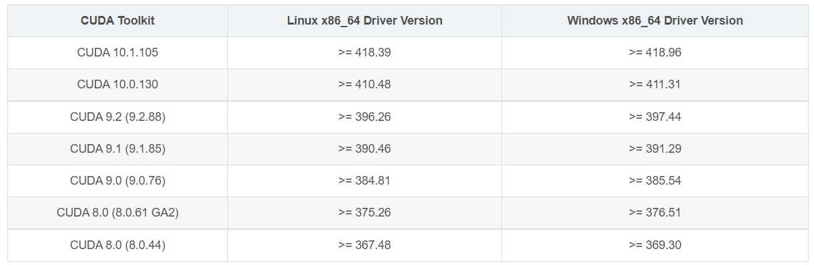

# Ubuntu18.04上安装cuda10+cudnn7（可多版本cuda切换）

### 0 换国内源+显卡驱动更新

##### 更换Ubuntu下载源

参考链接：[Ubuntu图形界面换源](https://blog.csdn.net/daerzei/article/details/84873964)

##### 显卡驱动更新

**法一：通过图形界面**
应用程序–>软件与更新–>开发者选项–>勾选提前释放出的更新


软件与更新–>附加驱动–>选择nvidia最新驱动，然后选择应用更改


法二：利用终端命令行
打开终端，按照如下步骤（不用输入每行代码前的$），即可更新英伟达驱动到指定版本。

```she
$ sudo apt update
$ ubuntu-drivers devices

== /sys/devices/pci0000:00/0000:00:01.0/0000:01:00.0 ==
modalias : pci:v000010DEd00001C03sv00001043sd000085ABbc03sc00i00
vendor   : NVIDIA Corporation
model    : GP106 [GeForce GTX 1060 6GB]
driver   : nvidia-driver-410 - third-party free
driver   : nvidia-driver-430 - third-party free recommended
driver   : nvidia-driver-396 - third-party free
driver   : xserver-xorg-video-nouveau - distro free builtin

# 或者安装指定驱动(这里挑选自己需要的驱动,然后安装即可,不必卸载之前装过的驱动)
$ sudo apt install nvidia-driver-430
```


### 1 cuda10的安装

##### 1.1 下载对应版本的安装包



CUDA官方下载链接：https://developer.nvidia.com/cuda-10.0-download-archive


1.2 安装CUDA

```she
cp Dowloads  #跳转到下载的安装包所在目录，若已在该目录，则无需跳转
sudo chmod 777 cuda_10.0.130_410.48_linux.run
sudo ./cuda_10.0.130_410.48_linux.run
```

先按q退出说明(more…)，然后安装设置如下（一定要注意看下面的说明）：


驱动在之前单独安装，所以这里NVIDIA Accelerated Graphics Driver选n（避免安装报错）；
关于是否创建软链接symbolic link：如果后续需要安装多个CUDA版本，这里可以选择n，但后面一定要记得手动创建软链接(即必须执行步骤1.4)，否则cudnn的示例程序会报错，如果只装一个CUDA版本，就可以选择y(不需要执行步骤1.4)；

**1.3 将cuda、cuda10.0都配置到环境变量**

> 如果忘记配置环境变量，可能无法找到nvcc等命令，很重要。

打开终端，在终端中执行如下语句

```she
sudo gedit ~/.bashrc
```

此时会有一个文本被打开，将文本最小化，继续在文本末尾中加上如下几行代码：

```she
export PATH=$PATH:/usr/local/cuda
export LD_LIBRARY_PATH=$LD_LIBRARY_PATH:/usr/local/cuda/lib64
export PATH=/usr/local/cuda-10.0/bin:$PATH
export LD_LIBRARY_PATH=/usr/local/cuda-10.0/lib64:$LD_LIBRARY_PATH
```

保存之后即可关闭文本，然后再终端中运行如下代码，使其生效。

```she
source ~/.bashrc
```

参考博文链接：https://blog.csdn.net/qq_31456593/article/details/90170708

1.4 切换CUDA版本（在是否安装symbolic link时选了n的话，需要执行此步骤，如果选的y则无需执行此步骤）

```she
sudo rm -rf cuda    #删除现有的软链接
sudo ln -s /usr/local/cuda10.0 /usr/local/cuda    #建立新的软链接
nvcc --version    #查看当前使用的cuda版本
```

在下面这个图中，带箭头的cuda文件是软链接，而cuda10.0是咱们刚刚安装的版本，我们将cuda这个软链接指向cuda10.0，即可完成版本切换。先跳转到cuda文件夹所在目录，一般在/usr/local里面。利用stat cuda可以验证cuda环境变量是否添加成功，nvcc -V可以验证cuda10.0的环境变量是否添加成功：

```she
stat cuda
nvcc --version
```


运行结果如上图所示，可以看到cuda软链接指向了cuda10.0，当前运行的是cuda10.0的版本。
本节参考1：https://www.jianshu.com/p/6a6fbce9073f
本节参考2：https://blog.csdn.net/lxx4610/article/details/105795408

2 cuDNN7.6.2安装
这里我选用了第二种下载方法：下载了3个deb包来安装，见下图最底部的三个链接
cuDNN官方下载链接：https://developer.nvidia.com/rdp/cudnn-download（需要登陆、并勾选同意协议后，才能下载）


下图中2.3.2是通过Deb安装包安装，2.4小结是验证cuDNN是否安装成功。图片来自cuDNN：官网的安装教程


> 易错提醒：记得要将cuda和cuda10.0分别添加到环境变量！且需要将cuda链接到安装好的cuda10.0！否则CUDNN验证时会各种报错（比如不存在这个文件或目录等。）另外，cuDNN官网上下载的三个deb包容易出错，如果cuDNN安装时报错，可以重新下载。

