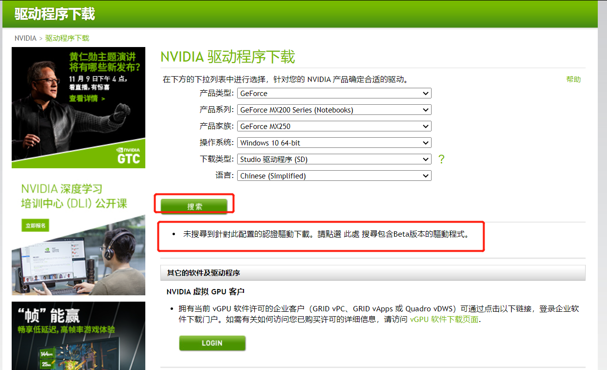
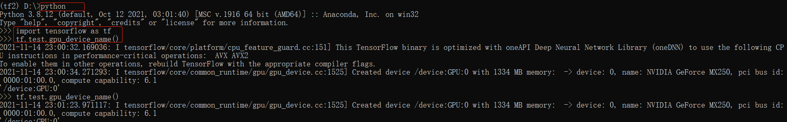

# Win10环境搭建-Tensorflow

## 1、环境安装

### 1.1、下载并安装nvidia显卡驱动

#### 1.1.1、查看自己机器显示型号

右键【此电脑】->【管理】


右侧->【显示适配器】->【NVIDIA GeForce MX250】便是本机的显卡型号了


#### 1.1.2、下载显卡驱动

NVIDIA显卡驱动下载地址https://www.nvidia.cn/Download/index.aspx?lang=cn

在下载界面按自己机器的显卡型号选择对应的驱动程序版本，如下：


其中【下载类型】有【Game Ready 驱动程序(GRD)】该驱动用于玩游戏，还有一个【Studio驱动程序(SD)】用于AI开发，所以我们选择的是【Studio驱动程序(SD)】


选择好驱动版本后，点【搜索按钮】



提示没有找到

从官网上看没有下载类型为:【Studio驱动程序(SD)】,只能退而求其次，选择【Game Ready 驱动程序(GRD)】类型的进行下载


点【下载】


下载链接为https://cn.download.nvidia.cn/Windows/496.49/496.49-notebook-win10-win11-64bit-international-dch-whql.exe

另一个显卡驱动程序下载的入口地址：https://www.nvidia.cn/geforce/drivers/


**NIVIDIA网站登录使用的是QQ账号密码进行的单点登录**

下载并一步一步按向导安装即可。

### 1.2、测试驱动安装是否成功

#### 1.2.1、在CMD界面输入nvidia-smi命令

```shell
D:\> nvidia-smi
```

显示结果如下：


如显示上面信息表示安装驱动成功，如果提示'nvidia-smi'不是内部或外部命令，也不是可支持的程序，则表示安装失败

如失败需要手动把C:\Program Files\NVIDIA Corporation\NVSMI添加到path的环境变量中，再重新打开cmd窗口执行nvidia-smi命令尝试

我是一次性成功，没有涉及失败这种情况，NVSMI在C:\Program Files;C:\Program Files (x86);两个目录下都没有找到，以后遇到再研究，暂时不再深追。

### 1.3、下载CUDA

在上一步的验证是否安装成功显卡驱动时，已显示可以安装的CUDA版本，如下


#### 1.3.1、CUDA下载界面地址

```java
https://developer.nvidia.com/cuda-downloads
```


根据自己机器的情况进行选择配置，并下载


下载CUDA的链接

```java
https://developer.download.nvidia.cn/compute/cuda/11.5.0/local_installers/cuda_11.5.0_496.13_win10.exe
```


### 1.4、下载cuDNN

下载界面地址

```java
https://developer.nvidia.com/cudnn
```


基于本机要安装CUDA11.5所以选择cuDNN v8.3.0


点开后，选择【cuDNN Library for Windows (x64)】


下载cnDNN的链接

```java
https://developer.download.nvidia.cn/compute/machine-learning/cudnn/secure/8.3.0/11.5_20211101/cudnn-11.5-windows-x64-v8.3.0.98.zip?TsPT64BSvX6YK0_ankw950bd2sjlh6iNBTOQ1NRetvFexln_bORrFdjSL7oftgdJtRpbJ-kAxxurCLlItFgZ55pjdiVE5oCG5pBzHyllZUraytCRBmlAMeWHNBcbLrK_244a9p7540sbByxxUKJsjAW6Wg1WOM2e0IklbooRqm6OzJtHmag8aXXo-p8RjRAz5t10ZK0xhxFij0LyAA
```

### 1.5、安装CUDA

#### 1.5.1、默认路径安装


#### 1.5.2、选择【自定义(C)】


一步一步按向导安装完成。

#### 1.5.3、配置系统环境变量

安装完CUDA 11.5后程序自动添加的环境变量，如下：


自动添加的变量

```shell
CUDA_PATH=C:\Program Files\NVIDIA GPU Computing Toolkit\CUDA\v11.5
CUDA_PATH_V11_5=C:\Program Files\NVIDIA GPU Computing Toolkit\CUDA\v11.5
```

还要添加以下几个环境变量

```shell
CUDA_SDK_PATH=C:\ProgramData\NVIDIA Corporation\CUDA Samples\v11.5
CUDA_LIB_PATH=%CUDA_PATH%\lib\x64
CUDA_BIN_PATH=%CUDA_PATH%\bin
CUDA_SDK_BIN_PATH=%CUDA_SDK_PATH%\bin\win64
CUDA_SDK_LIB_PATH=%CUDA_SDK_PATH%\common\lib\x64
```

在path环境变量后追加变量

```she
%CUDA_LIB_PATH%;%CUDA_BIN_PATH%%CUDA_SDK_BIN_PATH%;%CUDA_SDK_LIB_PATH%;

C:\Program Files\NVIDIA GPU Computing Toolkit\CUDA\v11.5\lib\x64
C:\Program Files\NVIDIA GPU Computing Toolkit\CUDA\v11.5\include
C:\Program Files\NVIDIA GPU Computing Toolkit\CUDA\v11.5\extras\CUPTI\lib64
C:\ProgramData\NVIDIA Corporation\CUDA Samples\v11.5\bin\win64
C:\ProgramData\NVIDIA Corporation\CUDA Samples\v11.5\common\lib\x64
```

添加完的效果


### 1.6、安装cuDNN

把下载的cuDNN包解压缩，然后把解压后目录中bin,include,lib中的文件复制到cuda的文件夹下

```she
C:\Program Files\NVIDIA GPU Computing Toolkit\CUDA\v11.5
```

### 1.7、CUDA安装测试

打开CMD执行

```she
nvcc -V
```

得到的信息如下：


## 2、软件安装

### 2.1、查看cuda版本是否与tensorflow2兼容

```shell
CUDA:11.5
cuDNN：8.3.0
https://tensorflow.google.cn/install/source_windows?hl=en#gpu
```


### 2.2、下载Anaconda

anaconda下载界面地址

```shell
https://www.anaconda.com/products/individual
```


下载链接地址

```shell
https://repo.anaconda.com/archive/Anaconda3-2021.05-Windows-x86_64.exe
```

anaconda其它版本的下载地址

```shell
https://repo.anaconda.com/archive/
```

### 2.3、安装anaconda

一步一步按导引安装即可。

### 2.4、添加Anaconda国内镜像配置

```shell
conda config --add channels https://mirrors.tuna.tsinghua.edu.cn/anaconda/pkgs/free/
conda config --add channels https://mirrors.tuna.tsinghua.edu.cn/anaconda/pkgs/main/
conda config --set show_channel_urls yes
```


## 3、安装Tensorflow

### 3.1、创建虚拟环境

这里创建的tensorflow虚拟环境名为tf2

```shell
conda create -n tf2 python=3.8
```

安装完毕后提示界面 


### 3.2、激活tf2环境

```shell
conda activate tf2
```


创建成功的虚拟环境目录

```shell
environment location: C:\Users\zhangyanqing\anaconda3\envs\tf2
```


### 3.3、在tf2环境下安装tensorflow

```shell
# 安装CPU版tensorflow
pip install tensorflow -i https://pypi.tuna.tsinghua.edu.cn/simple

# 安装GPU版tensorflow
pip install tensorflow-gpu==2.7.0 -i https://pypi.tuna.tsinghua.edu.cn/simple
```

安装tensorflow-gpu如下


#### 3.3.1、测试tensorflow-gpu安装是否成功

```python
import tensorflow as tf
tf.test.gpu_device_name()
```

测试成功如图所示



## 4、跑项目

```py
# salt-segmentation-sample
python salt_1.py
```

### 4.1、GPU的性能表现


### 4.2、CPU的性能表现


### ==4.3、GPU失效不起作用==


**==通过以上监控看，GPU还是没有使上力气，因为版本的问题，全盘失败，需要重装==**

### ==4.4、解决方案参考==

对于上面的问题，stackoverflow.com有个答案，打算按此尝试一下

```she
https://stackoverflow.com/questions/69879188/could-not-load-library-cudnn-cnn-infer64-8-dll-error-code-126
```


综上看stackoverflow.com给出的方案是把cuDNN换成v8.2.2，报这个错是因为cuDNN的版本bug

## 5、参照方案解决问题

### 5.1、重新安装cuDNN

#### 5.1.1、下载cuDNN v8.2.0 for CUDA 11.x

```shell
https://developer.nvidia.com/rdp/cudnn-archive
```


#### 5.1.2、重新安装cuDNN

重新操作1.6、安装cuDNN

### 5.2、重新安装Tersorflow

重新操作3、安装Tersorflow,虚拟环境tf27

### 5.3、重新测试tensorflow-gpu

重新操作3.3.1、测试tensorflow-gpu安装是否成功


### 5.4、重跑项目

#### 5.4.1、成功后的版本

上述cuDNN的问题可以解决

至此现在的配置为

```shell
python=3.8 [版本重要]
CUDA=11.5  [版本重要]
cuDNN=8.2.0 [版本重要]
tensorflow-gpu=2.7.0 [版本重要]
Anaconda=4.10.1 [版本不重要]
```

虽然最终项目使用GPU还是没有跑起来，原因是本机的显存只有2G，报错 out of memory

但全流程下来路是通了。

==说明：cuDNN8.3.0有问题，需要换成8.2.x，而对应的CUDA 可以是11.5，也可以是11.4==


#### 5.4.2、跑项目遇OOM


#### 5.4.3、解决OOM

本来很沮丧了，觉得只能买好的硬件了。但绝处逢生，如下操作。

因为报OOM，而此时程序的batch_size=32,epoch=100

经过改变batch_size=4,epoch=10可以正常跑通程序的主流程，程序运行日志：

程序代码已使用上cuDNN,如下：


此时，GPU的使用情况如下，==纯GPU的利用率在85%左右==


此时的CPU消耗，==利用率在45%==，如下：


#### 5.4.4、程序结果

##### 5.4.4.1、原图与原标注图


##### 5.4.4.2、数据加工后的原图与标注图


##### 5.4.4.3、训练集损失值与验证集损失值曲线图


##### 5.4.4.4、预测图


